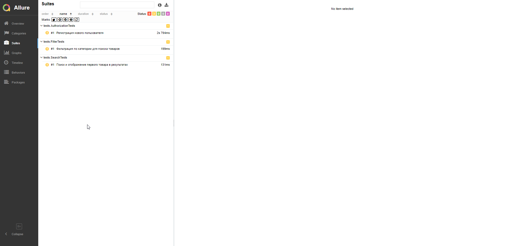

# Демо проект по автоматизации UI Ozon

## Содержание

> ➠ [Покрытый функционал](#earth_africa-покрытый-функционал)
>
> ➠ [Технологический стек](#classical_building-технологический-стек)
>
> ➠ [Запуск тестов из терминала](#запуск-тестов-из-терминала)
>
> ➠ [Запуск тестов в Jenkins](#robot-удаленный-запуск-тестов)
>
> ➠ [Отчет о результатах тестирования в Allure Report](#skier-главная-страница-allure-отчета)
>
> ➠ [Уведомления в Telegram с использованием бота](#-уведомления-в-telegram-с-использованием-бота)
>
> ➠ [Пример запуска теста в Selenoid](#-пример-запуска-теста-в-selenoid)

## :earth_africa: Покрытый функционал

> Разработаны автотесты на <code>UI</code>.
### UI

- [x] Тестирование формы поиска Ozon
- [x] Тестирование формы авторизации / регистрации
- [x] Тестирование фильтрации поиска товаров по категории

## Технологический стек
    
<p align="center">


</p>

В данном проекте автотесты написаны на <code>Java</code> с использованием <code>Selenide</code> для UI-тестов.

Реализован паттерн PageObject
>
> <code>Selenoid</code> выполняет запуск браузеров в контейнерах <code>Docker</code>.
>
> <code>Allure Report</code> формирует отчет о запуске тестов.
>
> Для автоматизированной сборки проекта используется <code>Gradle</code>.
>
> В качестве библиотеки для модульного тестирования используется <code>JUnit 5</code>.
>
> <code>Jenkins</code> выполняет запуск тестов.
> После завершения прогона отправляются уведомления с помощью бота в <code>Telegram</code>.


## Запуск тестов из терминала
```
gradle clean test
```
## Пример запуска 

<p align="center">

</p>


### Удаленный запуск тестов на Jenkins

```
clean
test
-Duser=${USER}
-Dpassword=${PASSWORD}
-DremoteBrowser=${REMOTE_DRIVER_URL}
-Dbrowser=${BROWSER}
-Dsize=${BROUSERSIZE}
-Dversion=${VERSION}
```
### Параметры сборки

> <code>REMOTE_DRIVER_URL</code> – адрес удаленного сервера, на котором будут запускаться тесты.
>
> <code>BROWSER</code> – браузер, в котором будут выполняться тесты (_по умолчанию - <code>chrome</code>_).
>
> <code>BROWSER_VERSION</code> – версия браузера, в которой будут выполняться тесты (_по умолчанию - <code>91.0</code>_).
>
> <code>BROWSER_SIZE</code> – размер окна браузера, в котором будут выполняться тесты (_по умолчанию - <code>1920x1080</code>_).

## Пример запуска тестов из Jenkins с настраиваемыми параметрами 
> Cборка настроена для прогона тестов на удаленном браузере в Selenoid.


<p align="center">

</p>


### Главная страница Allure-отчета

<p align="center">

</p>

### Suites
<p align="center">

</p>

### Allure TestOps
<p align="center">

</p>

##  Уведомления в Telegram с использованием бота

> После завершения сборки специальный бот, созданный в <code>Telegram</code>, автоматически обрабатывает и отправляет сообщение с отчетом о прогоне.

<p align="center">

</p>

> Конфигурация бота в параметрах сборки Jenkins
> 
<p align="center">

</p>